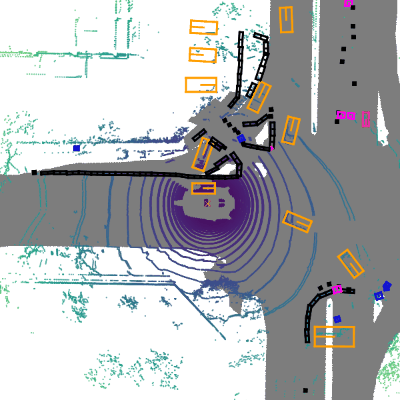

<div align="center">
  
  <div>&nbsp;</div>
  <div align="center">
    <b><font size="5">OpenMMLab 官网</font></b>
    <sup>
      <a href="https://openmmlab.com">
        <i><font size="4">HOT</font></i>
      </a>
    </sup>
    &nbsp;&nbsp;&nbsp;&nbsp;
    <b><font size="5">OpenMMLab 开放平台</font></b>
    <sup>
      <a href="https://platform.openmmlab.com">
        <i><font size="4">TRY IT OUT</font></i>
      </a>
    </sup>
  </div>
  <div>&nbsp;</div>
</div>

[](https://mmdetection3d.readthedocs.io/en/latest/)
[](https://github.com/open-mmlab/mmdetection3d/actions)
[](https://codecov.io/gh/open-mmlab/mmdetection3d)
[](https://github.com/open-mmlab/mmdetection3d/blob/master/LICENSE)


**新闻**: 我们发布了版本 v1.0.0rc0.

说明：我们正在进行大规模的重构，以提供对许多模块更简单、更统一的使用。

由于坐标系的统一和简化，模型的兼容性会受到影响。目前，大多数模型都以类似的性能对齐了精度，但仍有少数模型在进行基准测试。

在第三届 [nuScenes 3D 检测挑战赛](https://www.nuscenes.org/object-detection?externalData=all&mapData=all&modalities=Any)（第五届 AI Driving Olympics, NeurIPS 2020）中，我们获得了最佳 PKL 奖、第三名和最好的纯视觉的结果，相关的代码和模型将会在不久后发布。

最好的纯视觉方法 [FCOS3D](https://arxiv.org/abs/2104.10956) 的代码和模型已经发布。请继续关注我们的多模态检测器 [MoCa](https://arxiv.org/abs/2012.12741)。

文档: https://mmdetection3d.readthedocs.io/

## 简介

[English](README.md) | 简体中文

主分支代码目前支持 PyTorch 1.3 以上的版本。

MMDetection3D 是一个基于 PyTorch 的目标检测开源工具箱, 下一代面向3D检测的平台. 它是 OpenMMlab 项目的一部分，这个项目由香港中文大学多媒体实验室和商汤科技联合发起.



### 主要特性

- **支持多模态/单模态的检测器**

  支持多模态/单模态检测器，包括 MVXNet，VoteNet，PointPillars 等。

- **支持户内/户外的数据集**

  支持室内/室外的3D检测数据集，包括 ScanNet, SUNRGB-D, Waymo, nuScenes, Lyft, KITTI.

  对于 nuScenes 数据集, 我们也支持 [nuImages 数据集](https://github.com/open-mmlab/mmdetection3d/tree/master/configs/nuimages).

- **与 2D 检测器的自然整合**

   [MMDetection](https://github.com/open-mmlab/mmdetection/blob/master/docs/zh_cn/model_zoo.md) 支持的**300+个模型 , 40+的论文算法**, 和相关模块都可以在此代码库中训练或使用。

- **性能高**

   训练速度比其他代码库更快。下表可见主要的对比结果。更多的细节可见[基准测评文档](./docs/zh_cn/benchmarks.md)。我们对比了每秒训练的样本数（值越高越好）。其他代码库不支持的模型被标记为 `×`。

  | Methods | MMDetection3D | [OpenPCDet](https://github.com/open-mmlab/OpenPCDet) |[votenet](https://github.com/facebookresearch/votenet)| [Det3D](https://github.com/poodarchu/Det3D) |
  |:-------:|:-------------:|:---------:|:-----:|:-----:|
  | VoteNet | 358           | ×         |   77  | ×     |
  | PointPillars-car| 141           | ×         |   ×  | 140     |
  | PointPillars-3class| 107           |44     |   ×      | ×    |
  | SECOND| 40           |30     |   ×      | ×    |
  | Part-A2| 17           |14     |   ×      | ×    |

和 [MMDetection](https://github.com/open-mmlab/mmdetection)，[MMCV](https://github.com/open-mmlab/mmcv) 一样, MMDetection3D 也可以作为一个库去支持各式各样的项目.

## 开源许可证

该项目采用 [Apache 2.0 开源许可证](LICENSE)。

## 更新日志

最新的版本 v1.0.0rc0 在 2022.2.18 发布。
如果想了解更多版本更新细节和历史信息，请阅读[更新日志](docs/zh_cn/changelog.md)。

## 基准测试和模型库

测试结果和模型可以在[模型库](docs/zh_cn/model_zoo.md)中找到。

已支持的骨干网络：

- [x] PointNet (CVPR'2017)
- [x] PointNet++ (NeurIPS'2017)
- [x] RegNet (CVPR'2020)
- [x] DGCNN (TOG'2019)
- [x] DLA (CVPR'2018)

已支持的算法：

- [x] [SECOND (Sensor'2018)](configs/second/README.md)
- [x] [PointPillars (CVPR'2019)](configs/pointpillars/README.md)
- [x] [FreeAnchor (NeurIPS'2019)](configs/free_anchor/README.md)
- [x] [VoteNet (ICCV'2019)](configs/votenet/README.md)
- [x] [H3DNet (ECCV'2020)](configs/h3dnet/README.md)
- [x] [3DSSD (CVPR'2020)](configs/3dssd/README.md)
- [x] [Part-A2 (TPAMI'2020)](configs/parta2/README.md)
- [x] [MVXNet (ICRA'2019)](configs/mvxnet/README.md)
- [x] [CenterPoint (CVPR'2021)](configs/centerpoint/README.md)
- [x] [SSN (ECCV'2020)](configs/ssn/README.md)
- [x] [ImVoteNet (CVPR'2020)](configs/imvotenet/README.md)
- [x] [FCOS3D (ICCVW'2021)](configs/fcos3d/README.md)
- [x] [PointNet++ (NeurIPS'2017)](configs/pointnet2/README.md)
- [x] [Group-Free-3D (ICCV'2021)](configs/groupfree3d/README.md)
- [x] [ImVoxelNet (WACV'2022)](configs/imvoxelnet/README.md)
- [x] [PAConv (CVPR'2021)](configs/paconv/README.md)
- [x] [DGCNN (TOG'2019)](configs/dgcnn/README.md)
- [x] [SMOKE (CVPRW'2020)](configs/smoke/README.md)
- [x] [PGD (CoRL'2021)](configs/pgd/README.md)

|                    | ResNet   | ResNeXt  | SENet    |PointNet++ |DGCNN     | HRNet | RegNetX | Res2Net | DLA |
|--------------------|:--------:|:--------:|:--------:|:---------:|:---------:|:-----:|:--------:|:-----:|:---:|
| SECOND             | ☐        | ☐        | ☐        | ✗         | ✗         | ☐     | ✓        | ☐     | ✗
| PointPillars       | ☐        | ☐        | ☐        | ✗         | ✗         | ☐     | ✓        | ☐     | ✗
| FreeAnchor         | ☐        | ☐        | ☐        | ✗         | ✗         | ☐     | ✓        | ☐     | ✗
| VoteNet            | ✗        | ✗        | ✗        | ✓         | ✗         | ✗     | ✗        | ✗     | ✗
| H3DNet            | ✗        | ✗        | ✗        | ✓         | ✗         | ✗     | ✗        | ✗     | ✗
| 3DSSD            | ✗        | ✗        | ✗        | ✓         | ✗         | ✗     | ✗        | ✗     | ✗
| Part-A2            | ☐        | ☐        | ☐        | ✗         | ✗         | ☐     | ✓        | ☐     | ✗
| MVXNet             | ☐        | ☐        | ☐        | ✗         | ✗         | ☐     | ✓        | ☐     | ✗
| CenterPoint        | ☐        | ☐        | ☐        | ✗         | ✗         | ☐     | ✓        | ☐     | ✗
| SSN                | ☐        | ☐        | ☐        | ✗         | ✗         | ☐     | ✓        | ☐     | ✗
| ImVoteNet            | ✗        | ✗        | ✗        | ✓         | ✗         | ✗     | ✗        | ✗     | ✗
| FCOS3D               | ✓        | ☐        | ☐        | ✗         | ✗         | ☐     | ☐        | ☐     | ✗
| PointNet++           | ✗        | ✗        | ✗        | ✓         | ✗         | ✗     | ✗        | ✗     | ✗
| Group-Free-3D        | ✗        | ✗        | ✗        | ✓         | ✗         | ✗     | ✗        | ✗     | ✗
| ImVoxelNet           | ✓         | ✗        | ✗        | ✗        | ✗         | ✗     | ✗        | ✗     | ✗
| PAConv               | ✗        | ✗        | ✗        | ✓         | ✗         | ✗     | ✗        | ✗     | ✗
| DGCNN                | ✗        | ✗        | ✗        | ✗         | ✓         | ✗     | ✗        | ✗     | ✗
| SMOKE                | ✗        | ✗        | ✗        | ✗         | ✗         | ✗     | ✗        | ✗     | ✓
| PGD                  | ✓        | ☐        | ☐        | ✗         | ✗         | ☐     | ☐        | ☐     | ✗

其他特性
- [x] [Dynamic Voxelization](configs/dynamic_voxelization/README.md)

**注意：** [MMDetection](https://github.com/open-mmlab/mmdetection/blob/master/docs/zh_cn/model_zoo.md) 支持的基于2D检测的**300+个模型 , 40+的论文算法**在 MMDetection3D 中都可以被训练或使用。

## 安装

请参考[快速入门文档](docs/zh_cn/getting_started.md)进行安装。

## 快速入门

请参考[快速入门文档](docs/zh_cn/getting_started.md)学习 MMDetection3D 的基本使用。 我们为新手提供了分别针对[已有数据集](docs/zh_cn/1_exist_data_model.md)和[新数据集](docs/zh_cn/2_new_data_model.md)的使用指南。我们也提供了一些进阶教程，内容覆盖了[学习配置文件](docs/zh_cn/tutorials/config.md), [增加数据集支持](docs/zh_cn/tutorials/customize_dataset.md), [设计新的数据预处理流程](docs/zh_cn/tutorials/data_pipeline.md), [增加自定义模型](docs/zh_cn/tutorials/customize_models.md), [增加自定义的运行时配置](docs/zh_cn/tutorials/customize_runtime.md)和 [Waymo 数据集](docs/zh_cn/tutorials/waymo.md).

请参考 [FAQ](docs/zh_cn/faq.md) 查看一些常见的问题与解答。在升级 MMDetection3D 的版本时，请查看[兼容性文档](docs/zh_cn/compatibility.md)以知晓每个版本引入的不与之前版本兼容的更新。

## 引用

如果你觉得本项目对你的研究工作有所帮助，请参考如下 bibtex 引用 MMdetection3D

```latex
@misc{mmdet3d2020,
    title={{MMDetection3D: OpenMMLab} next-generation platform for general {3D} object detection},
    author={MMDetection3D Contributors},
    howpublished = {\url{https://github.com/open-mmlab/mmdetection3d}},
    year={2020}
}
```

## 贡献指南

我们感谢所有的贡献者为改进和提升 MMDetection3D 所作出的努力。请参考[贡献指南](.github/CONTRIBUTING.md)来了解参与项目贡献的相关指引。

## 致谢

MMDetection3D 是一款由来自不同高校和企业的研发人员共同参与贡献的开源项目。我们感谢所有为项目提供算法复现和新功能支持的贡献者，以及提供宝贵反馈的用户。我们希望这个工具箱和基准测试可以为社区提供灵活的代码工具，供用户复现已有算法并开发自己的新的 3D 检测模型。

## OpenMMLab 的其他项目

- [MMCV](https://github.com/open-mmlab/mmcv): OpenMMLab 计算机视觉基础库
- [MIM](https://github.com/open-mmlab/mim): MIM 是 OpenMMlab 项目、算法、模型的统一入口
- [MMClassification](https://github.com/open-mmlab/mmclassification): OpenMMLab 图像分类工具箱
- [MMDetection](https://github.com/open-mmlab/mmdetection): OpenMMLab 目标检测工具箱
- [MMDetection3D](https://github.com/open-mmlab/mmdetection3d): OpenMMLab 新一代通用 3D 目标检测平台
- [MMSegmentation](https://github.com/open-mmlab/mmsegmentation): OpenMMLab 语义分割工具箱
- [MMAction2](https://github.com/open-mmlab/mmaction2): OpenMMLab 新一代视频理解工具箱
- [MMTracking](https://github.com/open-mmlab/mmtracking): OpenMMLab 一体化视频目标感知平台
- [MMPose](https://github.com/open-mmlab/mmpose): OpenMMLab 姿态估计工具箱
- [MMEditing](https://github.com/open-mmlab/mmediting): OpenMMLab 图像视频编辑工具箱
- [MMOCR](https://github.com/open-mmlab/mmocr): OpenMMLab 全流程文字检测识别理解工具包
- [MMGeneration](https://github.com/open-mmlab/mmgeneration): OpenMMLab 图片视频生成模型工具箱
- [MMFlow](https://github.com/open-mmlab/mmflow): OpenMMLab 光流估计工具箱与测试基准
- [MMFewShot](https://github.com/open-mmlab/mmfewshot): OpenMMLab 少样本学习工具箱与测试基准
- [MMHuman3D](https://github.com/open-mmlab/mmhuman3d): OpenMMLab 人体参数化模型工具箱与测试基准
- [MMSelfSup](https://github.com/open-mmlab/mmselfsup): OpenMMLab 自监督学习工具箱与测试基准
- [MMRazor](https://github.com/open-mmlab/mmrazor): OpenMMLab 模型压缩工具箱与测试基准
- [MMDeploy](https://github.com/open-mmlab/mmdeploy): OpenMMLab 模型部署框架

## 欢迎加入 OpenMMLab 社区

扫描下方的二维码可关注 OpenMMLab 团队的 [知乎官方账号](https://www.zhihu.com/people/openmmlab)，加入 OpenMMLab 团队的 [官方交流 QQ 群](https://jq.qq.com/?_wv=1027&k=aCvMxdr3)

<div align="center">
  
</div>

我们会在 OpenMMLab 社区为大家

- 📢 分享 AI 框架的前沿核心技术
- 💻 解读 PyTorch 常用模块源码
- 📰 发布 OpenMMLab 的相关新闻
- 🚀 介绍 OpenMMLab 开发的前沿算法
- 🏃 获取更高效的问题答疑和意见反馈
- 🔥 提供与各行各业开发者充分交流的平台

干货满满 📘，等你来撩 💗，OpenMMLab 社区期待您的加入 👬
