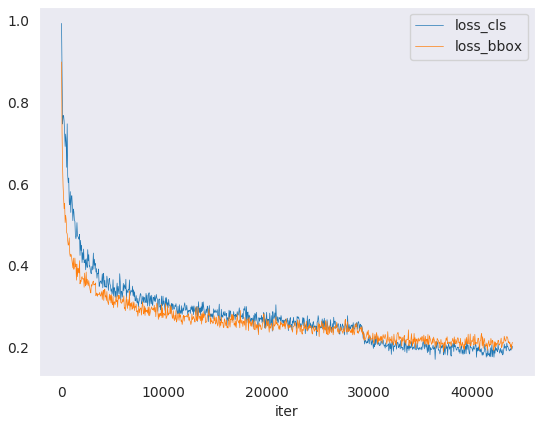

# Getting Started

This page provides basic tutorials about the usage of MMDetection3D.
For installation instructions, please see [install.md](install.md).

## Prepare datasets

It is recommended to symlink the dataset root to `$MMDETECTION3D/data`.
If your folder structure is different from the following, you may need to change the corresponding paths in config files.

```
mmdetection3d
├── mmdet3d
├── tools
├── configs
├── data
│   ├── nuscenes
│   │   ├── maps
│   │   ├── samples
│   │   ├── sweeps
│   │   ├── v1.0-test
|   |   ├── v1.0-trainval
│   ├── kitti
│   │   ├── ImageSets
│   │   ├── testing
│   │   │   ├── calib
│   │   │   ├── image_2
│   │   │   ├── velodyne
│   │   ├── training
│   │   │   ├── calib
│   │   │   ├── image_2
│   │   │   ├── label_2
│   │   │   ├── velodyne
│   ├── waymo
│   │   ├── waymo_format
│   │   │   ├── training
│   │   │   ├── validation
│   │   │   ├── testing
│   │   │   ├── gt.bin
│   │   ├── kitti_format
│   │   │   ├── ImageSets
│   ├── lyft
│   │   ├── v1.01-train
│   │   │   ├── v1.01-train (train_data)
│   │   │   ├── lidar (train_lidar)
│   │   │   ├── images (train_images)
│   │   │   ├── maps (train_maps)
│   │   ├── v1.01-test
│   │   │   ├── v1.01-test (test_data)
│   │   │   ├── lidar (test_lidar)
│   │   │   ├── images (test_images)
│   │   │   ├── maps (test_maps)
│   │   ├── train.txt
│   │   ├── val.txt
│   │   ├── test.txt
│   │   ├── sample_submission.csv
│   ├── scannet
│   │   ├── meta_data
│   │   ├── scans
│   │   ├── batch_load_scannet_data.py
│   │   ├── load_scannet_data.py
│   │   ├── scannet_utils.py
│   │   ├── README.md
│   ├── sunrgbd
│   │   ├── OFFICIAL_SUNRGBD
│   │   ├── matlab
│   │   ├── sunrgbd_data.py
│   │   ├── sunrgbd_utils.py
│   │   ├── README.md

```

Download KITTI 3D detection data [HERE](http://www.cvlibs.net/datasets/kitti/eval_object.php?obj_benchmark=3d). Prepare kitti data by running

```bash
mkdir ./data/kitti/ && mkdir ./data/kitti/ImageSets

# Download data split
wget -c  https://raw.githubusercontent.com/traveller59/second.pytorch/master/second/data/ImageSets/test.txt --no-check-certificate --content-disposition -O ./data/kitti/ImageSets/test.txt
wget -c  https://raw.githubusercontent.com/traveller59/second.pytorch/master/second/data/ImageSets/train.txt --no-check-certificate --content-disposition -O ./data/kitti/ImageSets/train.txt
wget -c  https://raw.githubusercontent.com/traveller59/second.pytorch/master/second/data/ImageSets/val.txt --no-check-certificate --content-disposition -O ./data/kitti/ImageSets/val.txt
wget -c  https://raw.githubusercontent.com/traveller59/second.pytorch/master/second/data/ImageSets/trainval.txt --no-check-certificate --content-disposition -O ./data/kitti/ImageSets/trainval.txt

python tools/create_data.py kitti --root-path ./data/kitti --out-dir ./data/kitti --extra-tag kitti
```

Download Waymo open dataset V1.2 [HERE](https://waymo.com/open/download/) and its data split [HERE](https://drive.google.com/drive/folders/18BVuF_RYJF0NjZpt8SnfzANiakoRMf0o?usp=sharing). Then put tfrecord files into corresponding folders in `data/waymo/waymo_format/` and put the data split txt files into `data/waymo/kitti_format/ImageSets`. Download ground truth bin file for validation set [HERE](https://console.cloud.google.com/storage/browser/waymo_open_dataset_v_1_2_0/validation/ground_truth_objects) and put it into `data/waymo/waymo_format/`. A tip is that you can use `gsutil` to download the large-scale dataset with commands. You can take this [tool](https://github.com/RalphMao/Waymo-Dataset-Tool) as an example for more details. Subsequently, prepare waymo data by running

```bash
python tools/create_data.py waymo --root-path ./data/waymo/ --out-dir ./data/waymo/ --workers 128 --extra-tag waymo
```

Note that if your local disk does not have enough space for saving converted data, you can change the `out-dir` to anywhere else. Just remember to create folders and prepare data there in advance and link them back to `data/waymo/kitti_format` after the data conversion.

Download nuScenes V1.0 full dataset data [HERE]( https://www.nuscenes.org/download). Prepare nuscenes data by running

```bash
python tools/create_data.py nuscenes --root-path ./data/nuscenes --out-dir ./data/nuscenes --extra-tag nuscenes
```

Download Lyft 3D detection data [HERE](https://www.kaggle.com/c/3d-object-detection-for-autonomous-vehicles/data). Prepare Lyft data by running

```bash
python tools/create_data.py lyft --root-path ./data/lyft --out-dir ./data/lyft --extra-tag lyft --version v1.01
```

Note that we follow the original folder names for clear organization. Please rename the raw folders as shown above.

To prepare scannet data, please see [scannet](https://github.com/open-mmlab/mmdetection3d/blob/master/data/scannet/README.md).

To prepare sunrgbd data, please see [sunrgbd](https://github.com/open-mmlab/mmdetection3d/blob/master/data/sunrgbd/README.md).

For using custom datasets, please refer to [Tutorials 2: Adding New Dataset](tutorials/new_dataset.md).

## Inference with pretrained models

We provide testing scripts to evaluate a whole dataset (SUNRGBD, ScanNet, KITTI, etc.),
and also some high-level apis for easier integration to other projects.

### Test a dataset

- single GPU
- single node multiple GPU
- multiple node

You can use the following commands to test a dataset.

```shell
# single-gpu testing
python tools/test.py ${CONFIG_FILE} ${CHECKPOINT_FILE} [--out ${RESULT_FILE}] [--eval ${EVAL_METRICS}] [--show]

# multi-gpu testing
./tools/dist_test.sh ${CONFIG_FILE} ${CHECKPOINT_FILE} ${GPU_NUM} [--out ${RESULT_FILE}] [--eval ${EVAL_METRICS}]
```

Optional arguments:
- `RESULT_FILE`: Filename of the output results in pickle format. If not specified, the results will not be saved to a file.
- `EVAL_METRICS`: Items to be evaluated on the results. Allowed values depend on the dataset, e.g., `proposal_fast`, `proposal`, `bbox`, `segm` are available for COCO, `mAP`, `recall` for PASCAL VOC. Cityscapes could be evaluated by `cityscapes` as well as all COCO metrics.
- `--show`: If specified, detection results will be plotted in the silient mode. It is only applicable to single GPU testing and used for debugging and visualization. This should be used with `--show-dir`.
- `--show-dir`: If specified, detection results will be plotted on the `***_points.obj` and `***_pred.ply` files in the specified directory. It is only applicable to single GPU testing and used for debugging and visualization. You do NOT need a GUI available in your environment for using this option.

Examples:

Assume that you have already downloaded the checkpoints to the directory `checkpoints/`.

1. Test votenet on ScanNet and save the points and prediction visualization results.

   ```shell
   python tools/test.py configs/votenet/votenet_8x8_scannet-3d-18class.py \
       checkpoints/votenet_8x8_scannet-3d-18class_20200620_230238-2cea9c3a.pth \
       --show --show-dir ./data/scannet/show_results
   ```

2. Test votenet on ScanNet, save the points, prediction, groundtruth visualization results, and evaluate the mAP.

   ```shell
   python tools/test.py configs/votenet/votenet_8x8_scannet-3d-18class.py \
       checkpoints/votenet_8x8_scannet-3d-18class_20200620_230238-2cea9c3a.pth \
       --eval mAP
       --options 'show=True' 'out_dir=./data/scannet/show_results'
   ```

3. Test votenet on ScanNet (without saving the test results) and evaluate the mAP.

   ```shell
   python tools/test.py configs/votenet/votenet_8x8_scannet-3d-18class.py \
       checkpoints/votenet_8x8_scannet-3d-18class_20200620_230238-2cea9c3a.pth \
       --eval mAP
   ```

4. Test SECOND with 8 GPUs, and evaluate the mAP.

   ```shell
   ./tools/slurm_test.sh ${PARTITION} ${JOB_NAME} configs/second/hv_second_secfpn_6x8_80e_kitti-3d-3class.py \
       checkpoints/hv_second_secfpn_6x8_80e_kitti-3d-3class_20200620_230238-9208083a.pth \
       --out results.pkl --eval mAP
   ```

5. Test PointPillars on nuscenes with 8 GPUs, and generate the json file to be submit to the official evaluation server.

   ```shell
   ./tools/slurm_test.sh ${PARTITION} ${JOB_NAME} configs/pointpillars/hv_pointpillars_fpn_sbn-all_4x8_2x_nus-3d.py \
       checkpoints/hv_pointpillars_fpn_sbn-all_4x8_2x_nus-3d_20200620_230405-2fa62f3d.pth \
       --format-only --options 'jsonfile_prefix=./pointpillars_nuscenes_results'
   ```

   The generated results be under `./pointpillars_nuscenes_results` directory.

6. Test SECOND on KITTI with 8 GPUs, and generate the pkl files and submission datas to be submit to the official evaluation server.

   ```shell
   ./tools/slurm_test.sh ${PARTITION} ${JOB_NAME} configs/second/hv_second_secfpn_6x8_80e_kitti-3d-3class.py \
       checkpoints/hv_second_secfpn_6x8_80e_kitti-3d-3class_20200620_230238-9208083a.pth \
       --format-only --options 'pklfile_prefix=./second_kitti_results' 'submission_prefix=./second_kitti_results'
   ```

   The generated results be under `./second_kitti_results` directory.

7. Test PointPillars on Lyft with 8 GPUs, generate the pkl files and make a submission to the leaderboard.

   ```shell
   ./tools/slurm_test.sh ${PARTITION} ${JOB_NAME} configs/pointpillars/hv_pointpillars_fpn_sbn-2x8_2x_lyft-3d.py \
       checkpoints/hv_pointpillars_fpn_sbn-2x8_2x_lyft-3d_latest.pth --out results/pp_lyft/results_challenge.pkl \
       --format-only --options 'jsonfile_prefix=results/pp_lyft/results_challenge' \
       'csv_path=results/pp_lyft/results_challenge.csv'
   ```

   **Notice**: To generate submissions on Lyft, `csv_path` must be given in the options. After generating the csv file, you can make a submission with kaggle commands given on the [website](https://www.kaggle.com/c/3d-object-detection-for-autonomous-vehicles/submit).

7. Test PointPillars on waymo with 8 GPUs, and evaluate the mAP with waymo metrics.

   ```shell
   ./tools/slurm_test.sh ${PARTITION} ${JOB_NAME} configs/pointpillars/hv_pointpillars_secfpn_sbn-2x16_2x_waymo-3d-car.py \
       checkpoints/hv_pointpillars_secfpn_sbn-2x16_2x_waymo-3d-car_latest.pth --out results/waymo-car/results_eval.pkl \
       --eval waymo --options 'pklfile_prefix=results/waymo-car/kitti_results' \
       'submission_prefix=results/waymo-car/kitti_results'
   ```

   **Notice**: For evaluation on waymo, please follow the [instruction](https://github.com/waymo-research/waymo-open-dataset/blob/master/docs/quick_start.md) to build the binary file `compute_detection_metrics_main` for metrics computation and put it into `mmdet3d/core/evaluation/waymo_utils/`.(Sometimes when using bazel to build `compute_detection_metrics_main`, an error `'round' is not a member of 'std'` may appear. We just need to remove the `std::` before `round` in that file.) `pklfile_prefix` should be given in the options for the bin file generation. For metrics, `waymo` is the recommended official evaluation prototype. Currently, evaluating with choice `kitti` is adapted from KITTI and the results for each difficulty are not exactly the same as the definition of KITTI. Instead, most of objects are marked with difficulty 0 currently, which will be fixed in the future. The reasons of its instability include the large computation for evalution, the lack of occlusion and truncation in the converted data, different definition of difficulty and different methods of computing average precision.

8. Test PointPillars on waymo with 8 GPUs, generate the bin files and make a submission to the leaderboard.

   ```shell
   ./tools/slurm_test.sh ${PARTITION} ${JOB_NAME} configs/pointpillars/hv_pointpillars_secfpn_sbn-2x16_2x_waymo-3d-car.py \
       checkpoints/hv_pointpillars_secfpn_sbn-2x16_2x_waymo-3d-car_latest.pth --out results/waymo-car/results_eval.pkl \
       --format-only --options 'pklfile_prefix=results/waymo-car/kitti_results' \
       'submission_prefix=results/waymo-car/kitti_results'
   ```

   **Notice**: After generating the bin file, you can simply build the binary file `create_submission` and use them to create a submission file by following the [instruction](https://github.com/waymo-research/waymo-open-dataset/blob/master/docs/quick_start.md). For evaluation on the validation set with the eval server, you can also use the same way to generate a submission.

### Visualization

To see the SUNRGBD, ScanNet or KITTI points and detection results, you can run the following command

```bash
python tools/test.py ${CONFIG_FILE} ${CKPT_PATH} --show --show-dir ${SHOW_DIR}
```

Aftering running this command, plotted results ***_points.obj and ***_pred.ply files in `${SHOW_DIR}`.

To see the points, detection results and ground truth of SUNRGBD, ScanNet or KITTI during evaluation time, you can run the following command
```bash
python tools/test.py ${CONFIG_FILE} ${CKPT_PATH} --eval 'mAP' --options 'show=True' 'out_dir=${SHOW_DIR}'
```
After running this command, you will obtain ***_points.ob, ***_pred.ply files and ***_gt.ply in `${SHOW_DIR}`.

You can use 3D visualization software such as the [MeshLab](http://www.meshlab.net/) to open the these files under `${SHOW_DIR}` to see the 3D detection output. Specifically, open `***_points.obj` to see the input point cloud and open `***_pred.ply` to see the predicted 3D bounding boxes. This allows the inference and results generation be done in remote server and the users can open them on their host with GUI.

**Notice**: The visualization API is a little unstable since we plan to refactor these parts together with MMDetection in the future.

### Point cloud demo

We provide a demo script to test a single sample.

```shell
python demo/pcd_demo.py ${PCD_FILE} ${CONFIG_FILE} ${CHECKPOINT_FILE} [--device ${GPU_ID}] [--score-thr ${SCORE_THR}] [--out-dir ${OUT_DIR}]
```

Examples:

```shell
python demo/pcd_demo.py demo/kitti_000008.bin configs/second/hv_second_secfpn_6x8_80e_kitti-3d-car.py checkpoints/hv_second_secfpn_6x8_80e_kitti-3d-car_20200620_230238-393f000c.pth
```
If you want to input a `ply` file, you can use the following function and convert it to `bin` format. Then you can use the converted `bin` file to generate demo.
Note that you need to install pandas and plyfile before using this script. This function can also be used for data preprocessing for training ```ply data```.
```python
import numpy as np
import pandas as pd
from plyfile import PlyData

def conver_ply(input_path, output_path):
    plydata = PlyData.read(input_path)  # read file
    data = plydata.elements[0].data  # read data
    data_pd = pd.DataFrame(data)  # convert to DataFrame
    data_np = np.zeros(data_pd.shape, dtype=np.float)  # initialize array to store data
    property_names = data[0].dtype.names  # read names of properties
    for i, name in enumerate(
            property_names):  # read data by property
        data_np[:, i] = data_pd[name]
    data_np.astype(np.float32).tofile(output_path)
```
Examples:

```python
convert_ply('./test.ply', './test.bin')
```

### High-level APIs for testing point clouds

#### Synchronous interface
Here is an example of building the model and test given point clouds.

```python
from mmdet3d.apis import init_detector, inference_detector

config_file = 'configs/votenet/votenet_8x8_scannet-3d-18class.py'
checkpoint_file = 'checkpoints/votenet_8x8_scannet-3d-18class_20200620_230238-2cea9c3a.pth'

# build the model from a config file and a checkpoint file
model = init_detector(config_file, checkpoint_file, device='cuda:0')

# test a single image and show the results
point_cloud = 'test.bin'
result, data = inference_detector(model, point_cloud)
# visualize the results and save the results in 'results' folder
model.show_results(data, result, out_dir='results')
```

A notebook demo can be found in [demo/inference_demo.ipynb](https://github.com/open-mmlab/mmdetection/blob/master/demo/inference_demo.ipynb).

## Train a model

MMDetection implements distributed training and non-distributed training,
which uses `MMDistributedDataParallel` and `MMDataParallel` respectively.

All outputs (log files and checkpoints) will be saved to the working directory,
which is specified by `work_dir` in the config file.

By default we evaluate the model on the validation set after each epoch, you can change the evaluation interval by adding the interval argument in the training config.
```python
evaluation = dict(interval=12)  # This evaluate the model per 12 epoch.
```

**Important**: The default learning rate in config files is for 8 GPUs and the exact batch size is marked by the config's file name, e.g. '2x8' means 2 samples per GPU using 8 GPUs.
According to the [Linear Scaling Rule](https://arxiv.org/abs/1706.02677), you need to set the learning rate proportional to the batch size if you use different GPUs or images per GPU, e.g., lr=0.01 for 4 GPUs * 2 img/gpu and lr=0.08 for 16 GPUs * 4 img/gpu. However, since most of the models in this repo use ADAM rather than SGD for optimization, the rule may not hold and users need to tune the learning rate by themselves.

### Train with a single GPU

```shell
python tools/train.py ${CONFIG_FILE} [optional arguments]
```

If you want to specify the working directory in the command, you can add an argument `--work_dir ${YOUR_WORK_DIR}`.

### Train with multiple GPUs

```shell
./tools/dist_train.sh ${CONFIG_FILE} ${GPU_NUM} [optional arguments]
```

Optional arguments are:

- `--no-validate` (**not suggested**): By default, the codebase will perform evaluation at every k (default value is 1, which can be modified like [this](https://github.com/open-mmlab/mmdetection/blob/master/configs/mask_rcnn/mask_rcnn_r50_fpn_1x_coco.py#L174)) epochs during the training. To disable this behavior, use `--no-validate`.
- `--work-dir ${WORK_DIR}`: Override the working directory specified in the config file.
- `--resume-from ${CHECKPOINT_FILE}`: Resume from a previous checkpoint file.
- `--options 'Key=value'`: Overide some settings in the used config.

Difference between `resume-from` and `load-from`:
`resume-from` loads both the model weights and optimizer status, and the epoch is also inherited from the specified checkpoint. It is usually used for resuming the training process that is interrupted accidentally.
`load-from` only loads the model weights and the training epoch starts from 0. It is usually used for finetuning.

### Train with multiple machines

If you run MMDetection on a cluster managed with [slurm](https://slurm.schedmd.com/), you can use the script `slurm_train.sh`. (This script also supports single machine training.)

```shell
[GPUS=${GPUS}] ./tools/slurm_train.sh ${PARTITION} ${JOB_NAME} ${CONFIG_FILE} ${WORK_DIR}
```

Here is an example of using 16 GPUs to train Mask R-CNN on the dev partition.

```shell
GPUS=16 ./tools/slurm_train.sh dev mask_r50_1x configs/mask_rcnn_r50_fpn_1x_coco.py /nfs/xxxx/mask_rcnn_r50_fpn_1x
```

You can check [slurm_train.sh](https://github.com/open-mmlab/mmdetection/blob/master/tools/slurm_train.sh) for full arguments and environment variables.

If you have just multiple machines connected with ethernet, you can refer to
PyTorch [launch utility](https://pytorch.org/docs/stable/distributed_deprecated.html#launch-utility).
Usually it is slow if you do not have high speed networking like InfiniBand.

### Launch multiple jobs on a single machine

If you launch multiple jobs on a single machine, e.g., 2 jobs of 4-GPU training on a machine with 8 GPUs,
you need to specify different ports (29500 by default) for each job to avoid communication conflict.

If you use `dist_train.sh` to launch training jobs, you can set the port in commands.

```shell
CUDA_VISIBLE_DEVICES=0,1,2,3 PORT=29500 ./tools/dist_train.sh ${CONFIG_FILE} 4
CUDA_VISIBLE_DEVICES=4,5,6,7 PORT=29501 ./tools/dist_train.sh ${CONFIG_FILE} 4
```

If you use launch training jobs with Slurm, there are two ways to specify the ports.

1. Set the port through `--options`. This is more recommended since it does not change the original configs.

   ```shell
   CUDA_VISIBLE_DEVICES=0,1,2,3 GPUS=4 ./tools/slurm_train.sh ${PARTITION} ${JOB_NAME} config1.py ${WORK_DIR} --options 'dist_params.port=29500'
   CUDA_VISIBLE_DEVICES=4,5,6,7 GPUS=4 ./tools/slurm_train.sh ${PARTITION} ${JOB_NAME} config2.py ${WORK_DIR} --options 'dist_params.port=29501'
   ```

2. Modify the config files (usually the 6th line from the bottom in config files) to set different communication ports.

   In `config1.py`,

   ```python
   dist_params = dict(backend='nccl', port=29500)
   ```

   In `config2.py`,

   ```python
   dist_params = dict(backend='nccl', port=29501)
   ```

   Then you can launch two jobs with `config1.py` ang `config2.py`.

   ```shell
   CUDA_VISIBLE_DEVICES=0,1,2,3 GPUS=4 ./tools/slurm_train.sh ${PARTITION} ${JOB_NAME} config1.py ${WORK_DIR}
   CUDA_VISIBLE_DEVICES=4,5,6,7 GPUS=4 ./tools/slurm_train.sh ${PARTITION} ${JOB_NAME} config2.py ${WORK_DIR}
   ```

## Useful tools

We provide lots of useful tools under `tools/` directory.

### Analyze logs

You can plot loss/mAP curves given a training log file. Run `pip install seaborn` first to install the dependency.



```shell
python tools/analyze_logs.py plot_curve [--keys ${KEYS}] [--title ${TITLE}] [--legend ${LEGEND}] [--backend ${BACKEND}] [--style ${STYLE}] [--out ${OUT_FILE}]
```

Examples:

- Plot the classification loss of some run.

  ```shell
  python tools/analyze_logs.py plot_curve log.json --keys loss_cls --legend loss_cls
  ```

- Plot the classification and regression loss of some run, and save the figure to a pdf.

  ```shell
  python tools/analyze_logs.py plot_curve log.json --keys loss_cls loss_bbox --out losses.pdf
  ```

- Compare the bbox mAP of two runs in the same figure.

  ```shell
  python tools/analyze_logs.py plot_curve log1.json log2.json --keys bbox_mAP --legend run1 run2
  ```

You can also compute the average training speed.

```shell
python tools/analyze_logs.py cal_train_time log.json [--include-outliers]
```

The output is expected to be like the following.

```
-----Analyze train time of work_dirs/some_exp/20190611_192040.log.json-----
slowest epoch 11, average time is 1.2024
fastest epoch 1, average time is 1.1909
time std over epochs is 0.0028
average iter time: 1.1959 s/iter

```

### Publish a model

Before you upload a model to AWS, you may want to
(1) convert model weights to CPU tensors, (2) delete the optimizer states and
(3) compute the hash of the checkpoint file and append the hash id to the filename.

```shell
python tools/publish_model.py ${INPUT_FILENAME} ${OUTPUT_FILENAME}
```

E.g.,

```shell
python tools/publish_model.py work_dirs/faster_rcnn/latest.pth faster_rcnn_r50_fpn_1x_20190801.pth
```

The final output filename will be `faster_rcnn_r50_fpn_1x_20190801-{hash id}.pth`.

## Tutorials

Currently, we provide four tutorials for users to [finetune models](tutorials/finetune.md), [add new dataset](tutorials/new_dataset.md), [design data pipeline](tutorials/data_pipeline.md) and [add new modules](tutorials/new_modules.md).
We also provide a full description about the [config system](config.md).
