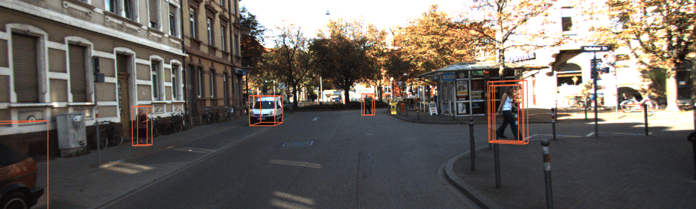
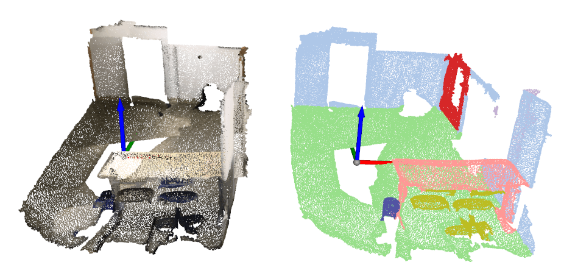

# 可视化

MMDetection3D 提供了 `Det3DLocalVisualizer` 用来在训练及测试阶段可视化和存储模型的状态以及结果，其具有以下特性：

1. 支持多模态数据和多任务的基本绘图界面。
2. 支持多个后端（如 local，TensorBoard），将训练状态（如 `loss`，`lr`）或模型评估指标写入指定的一个或多个后端中。
3. 支持多模态数据真实标签的可视化，3D 检测结果的跨模态可视化。

## 基本绘制界面

继承自 `DetLocalVisualizer`，`Det3DLocalVisualizer` 提供了在 2D 图像上绘制常见目标的界面，例如绘制检测框、点、文本、线、圆、多边形、二进制掩码等。关于 2D 绘制的更多细节，请参考 MMDetection 中的[可视化文档](https://mmengine.readthedocs.io/zh_CN/latest/advanced_tutorials/visualization.html)。这里我们介绍 3D 绘制界面。

### 在图像上绘制点云

通过使用 `draw_points_on_image`，我们支持在图像上绘制点云。

```python
import mmcv
import numpy as np
from mmengine import load

from mmdet3d.visualization import Det3DLocalVisualizer

info_file = load('demo/data/kitti/000008.pkl')
points = np.fromfile('demo/data/kitti/000008.bin', dtype=np.float32)
points = points.reshape(-1, 4)[:, :3]
lidar2img = np.array(info_file['data_list'][0]['images']['CAM2']['lidar2img'], dtype=np.float32)

visualizer = Det3DLocalVisualizer()
img = mmcv.imread('demo/data/kitti/000008.png')
img = mmcv.imconvert(img, 'bgr', 'rgb')
visualizer.set_image(img)
visualizer.draw_points_on_image(points, lidar2img)
visualizer.show()
```


### 在点云上绘制 3D 框

通过使用 `draw_bboxes_3d`，我们支持在点云上绘制 3D 框。

```python
import torch
import numpy as np

from mmdet3d.visualization import Det3DLocalVisualizer
from mmdet3d.structures import LiDARInstance3DBoxes

points = np.fromfile('demo/data/kitti/000008.bin', dtype=np.float32)
points = points.reshape(-1, 4)
visualizer = Det3DLocalVisualizer()
# set point cloud in visualizer
visualizer.set_points(points)
bboxes_3d = LiDARInstance3DBoxes(
    torch.tensor([[8.7314, -1.8559, -1.5997, 4.2000, 3.4800, 1.8900,
                   -1.5808]]))
# Draw 3D bboxes
visualizer.draw_bboxes_3d(bboxes_3d)
visualizer.show()
```


### 在图像上绘制投影的 3D 框

通过使用 `draw_proj_bboxes_3d`，我们支持在图像上绘制投影的 3D 框。

```python
import mmcv
import numpy as np
from mmengine import load

from mmdet3d.visualization import Det3DLocalVisualizer
from mmdet3d.structures import CameraInstance3DBoxes

info_file = load('demo/data/kitti/000008.pkl')
cam2img = np.array(info_file['data_list'][0]['images']['CAM2']['cam2img'], dtype=np.float32)
bboxes_3d = []
for instance in info_file['data_list'][0]['instances']:
    bboxes_3d.append(instance['bbox_3d'])
gt_bboxes_3d = np.array(bboxes_3d, dtype=np.float32)
gt_bboxes_3d = CameraInstance3DBoxes(gt_bboxes_3d)
input_meta = {'cam2img': cam2img}

visualizer = Det3DLocalVisualizer()

img = mmcv.imread('demo/data/kitti/000008.png')
img = mmcv.imconvert(img, 'bgr', 'rgb')
visualizer.set_image(img)
# project 3D bboxes to image
visualizer.draw_proj_bboxes_3d(gt_bboxes_3d, input_meta)
visualizer.show()
```

### 绘制 BEV 视角的框

通过使用 `draw_bev_bboxes`，我们支持绘制 BEV 视角下的框。

```python
import numpy as np
from mmengine import load

from mmdet3d.visualization import Det3DLocalVisualizer
from mmdet3d.structures import CameraInstance3DBoxes

info_file = load('demo/data/kitti/000008.pkl')
bboxes_3d = []
for instance in info_file['data_list'][0]['instances']:
    bboxes_3d.append(instance['bbox_3d'])
gt_bboxes_3d = np.array(bboxes_3d, dtype=np.float32)
gt_bboxes_3d = CameraInstance3DBoxes(gt_bboxes_3d)

visualizer = Det3DLocalVisualizer()
# set bev image in visualizer
visualizer.set_bev_image()
# draw bev bboxes
visualizer.draw_bev_bboxes(gt_bboxes_3d, edge_colors='orange')
visualizer.show()
```

### 绘制 3D 分割掩码

通过使用 `draw_seg_mask`，我们支持通过逐点着色来绘制分割掩码。

```python
import numpy as np

from mmdet3d.visualization import Det3DLocalVisualizer

points = np.fromfile('demo/data/sunrgbd/000017.bin', dtype=np.float32)
points = points.reshape(-1, 3)
visualizer = Det3DLocalVisualizer()
mask = np.random.rand(points.shape[0], 3)
points_with_mask = np.concatenate((points, mask), axis=-1)
# Draw 3D points with mask
visualizer.set_points(points, pcd_mode=2, vis_mode='add')
visualizer.draw_seg_mask(points_with_mask)
visualizer.show()
```

## 结果

如果想要可视化训练模型的预测结果，你可以运行如下指令：

```bash
python tools/test.py ${CONFIG_FILE} ${CKPT_PATH} --show --show-dir ${SHOW_DIR}
```

运行该指令后，绘制的结果（包括输入数据和网络输出在输入上的可视化）将会被保存在 `${SHOW_DIR}` 中。

运行该指令后，你将在 `${SHOW_DIR}` 中获得输入数据，网络输出和真是标签在输入上的可视化（如在多模态检测任务和基于视觉的检测任务中的 `***_gt.png` 和 `***_pred.png`）。当启用 `show` 时，[Open3D](http://www.open3d.org/) 将会用于在线可视化结果。如果你是在没有 GUI 的远程服务器上测试时，在线可视化是不被支持的。你可以从远程服务器中下载 `results.pkl`，并在本地机器上离线可视化预测结果。

使用 `Open3D` 后端离线可视化结果，你可以运行如下指令：

```bash
python tools/misc/visualize_results.py ${CONFIG_FILE} --result ${RESULTS_PATH} --show-dir ${SHOW_DIR}
```


这需要在远程服务器中能够推理并生成结果，然后用户在主机中使用 GUI 打开。

## 数据集

我们也提供了脚本来可视化数据集而无需推理。你可以使用 `tools/misc/browse_dataset.py` 来在线可视化加载的数据的真实标签，并保存在硬盘中。目前我们支持所有数据集的单模态 3D 检测和 3D 分割，KITTI 和 SUN RGB-D 的多模态 3D 检测，以及 nuScenes 的单目 3D 检测。如果想要浏览 KITTI 数据集，你可以运行如下指令：

```shell
python tools/misc/browse_dataset.py configs/_base_/datasets/kitti-3d-3class.py --task lidar_det --output-dir ${OUTPUT_DIR}
```

**注意**：一旦指定了 `--output-dir`，当在 open3d 窗口中按下 `_ESC_` 时，用户指定的视图图像将会被保存下来。如果你想要对点云进行缩放操作以观察更多细节， 你可以在命令中指定 `--show-interval=0`。

为了验证数据的一致性和数据增强的效果，你可以加上 `--aug` 来可视化数据增强后的数据，指令如下所示：

```shell
python tools/misc/browse_dataset.py configs/_base_/datasets/kitti-3d-3class.py --task det --aug --output-dir ${OUTPUT_DIR}
```

如果你想显示带有投影的 3D 边界框的 2D 图像，你需要一个支持多模态数据加载的配置文件，并将 `--task` 参数改为 `multi-modality_det`。示例如下：

```shell
python tools/misc/browse_dataset.py configs/mvxnet/mvxnet_fpn_dv_second_secfpn_8xb2-80e_kitti-3d-3class.py --task multi-modality_det --output-dir ${OUTPUT_DIR}
```



你可以使用不同的配置浏览不同的数据集，例如在 3D 语义分割任务中可视化 ScanNet 数据集：

```shell
python tools/misc/browse_dataset.py configs/_base_/datasets/scannet-seg.py --task lidar_seg --output-dir ${OUTPUT_DIR}
```



在单目 3D 检测任务中浏览 nuScenes 数据集：

```shell
python tools/misc/browse_dataset.py configs/_base_/datasets/nus-mono3d.py --task mono_det --output-dir ${OUTPUT_DIR}
```


