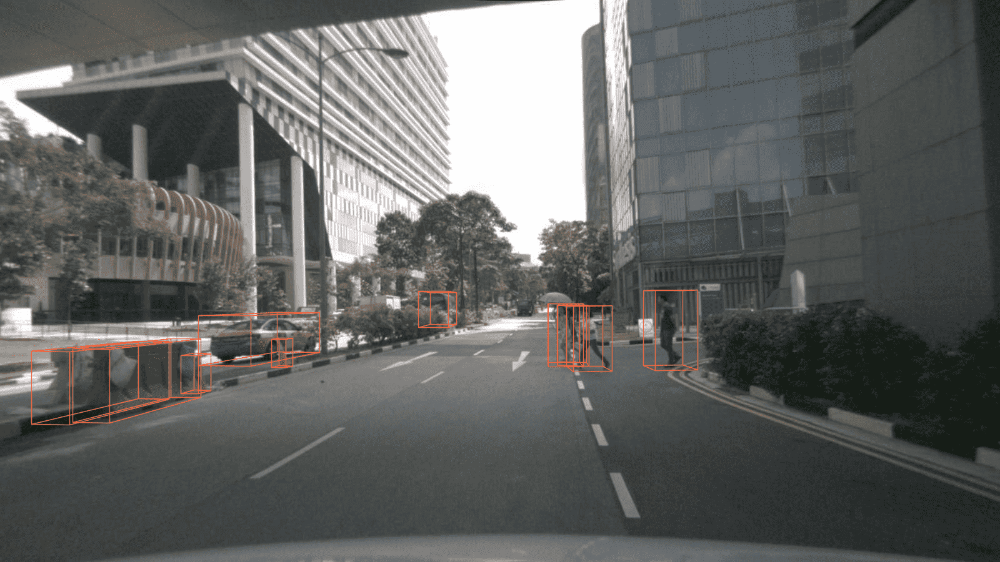

我们在 `tools/` 文件夹路径下提供了许多有用的工具。

# 日志分析

给定一个训练的日志文件，您可以绘制出 loss/mAP 曲线。首先需要运行 `pip install seaborn` 安装依赖包。


```shell
python tools/analysis_tools/analyze_logs.py plot_curve [--keys ${KEYS}] [--title ${TITLE}] [--legend ${LEGEND}] [--backend ${BACKEND}] [--style ${STYLE}] [--out ${OUT_FILE}] [--mode ${MODE}] [--interval ${INTERVAL}]
```

**注意**: 如果您想绘制的指标是在验证阶段计算得到的，您需要添加一个标志 `--mode eval` ，如果您每经过一个 `${INTERVAL}` 的间隔进行评估，您需要增加一个参数 `--interval ${INTERVAL}`。

示例：

-   绘制出某次运行的分类 loss。

    ```shell
    python tools/analysis_tools/analyze_logs.py plot_curve log.json --keys loss_cls --legend loss_cls
    ```

-   绘制出某次运行的分类和回归 loss，并且保存图片为 pdf 格式。

    ```shell
    python tools/analysis_tools/analyze_logs.py plot_curve log.json --keys loss_cls loss_bbox --out losses.pdf
    ```

-   在同一张图片中比较两次运行的 bbox mAP。

    ```shell
    # 根据 Car_3D_moderate_strict 在 KITTI 上评估 PartA2 和 second。
    python tools/analysis_tools/analyze_logs.py plot_curve tools/logs/PartA2.log.json tools/logs/second.log.json --keys KITTI/Car_3D_moderate_strict --legend PartA2 second --mode eval --interval 1
    # 根据 Car_3D_moderate_strict 在 KITTI 上分别对车和 3 类评估 PointPillars。
    python tools/analysis_tools/analyze_logs.py plot_curve tools/logs/pp-3class.log.json tools/logs/pp.log.json --keys KITTI/Car_3D_moderate_strict --legend pp-3class pp --mode eval --interval 2
    ```

您也能计算平均训练速度。

```shell
python tools/analysis_tools/analyze_logs.py cal_train_time log.json [--include-outliers]
```

预期输出应该如下所示。

```
-----Analyze train time of work_dirs/some_exp/20190611_192040.log.json-----
slowest epoch 11, average time is 1.2024
fastest epoch 1, average time is 1.1909
time std over epochs is 0.0028
average iter time: 1.1959 s/iter
```

&emsp;

# 可视化

## 结果

为了观察模型的预测结果，您可以运行下面的指令

```bash
python tools/test.py ${CONFIG_FILE} ${CKPT_PATH} --show --show-dir ${SHOW_DIR}
```

在运行这个指令后，所有的绘制结果包括输入数据，以及在输入数据基础上可视化的网络输出和真值（例如： 3D 单模态检测任务中的 `***_points.obj` 和 `***_pred.obj`），将会被保存在 `${SHOW_DIR}`。

要在评估期间看见预测结果，您可以运行下面的指令

```bash
python tools/test.py ${CONFIG_FILE} ${CKPT_PATH} --eval 'mAP' --eval-options 'show=True' 'out_dir=${SHOW_DIR}'
```

在运行这个指令后，您将会在 `${SHOW_DIR}` 获得输入数据、可视化在输入上的网络输出和真值标签（例如：在多模态检测任务中的`***_points.obj`，`***_pred.obj`，`***_gt.obj`，`***_img.png` 和 `***_pred.png` ）。当 `show` 被激活，[Open3D](http://www.open3d.org/) 将会被用来在线可视化结果。当在没有 GUI 的远程服务器上运行测试的时候，您需要设定 `show=False`。

至于离线可视化，您将有两个选择。
利用 `Open3D` 后端可视化结果，您可以运行下面的指令

```bash
python tools/misc/visualize_results.py ${CONFIG_FILE} --result ${RESULTS_PATH} --show-dir ${SHOW_DIR}
```


或者您可以使用 3D 可视化软件，例如 [MeshLab](http://www.meshlab.net/) 来打开这些在 `${SHOW_DIR}` 目录下的文件，从而查看 3D 检测输出。具体来说，打开 `***_points.obj` 查看输入点云，打开 `***_pred.obj` 查看预测的 3D 边界框。这允许推理和结果生成在远程服务器中完成，用户可以使用 GUI 在他们的主机上打开它们。

**注意**：可视化接口有一些不稳定，我们将计划和 MMDetection 一起重构这一部分。

## 数据集

我们也提供脚本用来可视化数据集，而无需推理。您可以使用 `tools/misc/browse_dataset.py` 来在线显示载入的数据和真值标签，并且保存进磁盘。现在我们支持所有数据集上的单模态 3D 检测和 3D 分割，支持 KITTI 和 SUN RGB-D 数据集上的多模态 3D 检测，同时支持 nuScenes 数据集上的单目 3D 检测。为了浏览 KITTI 数据集，您可以运行下面的指令

```shell
python tools/misc/browse_dataset.py configs/_base_/datasets/kitti-3d-3class.py --task det --output-dir ${OUTPUT_DIR} --online
```

**注意**：一旦指定 `--output-dir` ，当按下 open3d 窗口的 `_ESC_`，用户指定的视图图像将被保存。如果您没有显示器，您可以移除 `--online` 标志，从而仅仅保存可视化结果并且进行离线浏览。

如果您还想显示 2D 图像以及投影的 3D 边界框，则需要找到支持多模态数据加载的配置文件，然后将 `--task` 参数更改为 `multi_modality-det`。一个例子如下所示

```shell
python tools/misc/browse_dataset.py configs/mvxnet/dv_mvx-fpn_second_secfpn_adamw_2x8_80e_kitti-3d-3class.py --task multi_modality-det --output-dir ${OUTPUT_DIR} --online
```


您可以简单的使用不同的配置文件，浏览不同的数据集，例如：在 3D 语义分割任务中可视化 ScanNet 数据集

```shell
python tools/misc/browse_dataset.py configs/_base_/datasets/scannet_seg-3d-20class.py --task seg --output-dir ${OUTPUT_DIR} --online
```


在单目 3D 检测任务中浏览 nuScenes 数据集

```shell
python tools/misc/browse_dataset.py configs/_base_/datasets/nus-mono3d.py --task mono-det --output-dir ${OUTPUT_DIR} --online
```



&emsp;

# 模型复杂度

您可以使用 MMDetection 中的 `tools/analysis_tools/get_flops.py` 这个脚本文件，基于 [flops-counter.pytorch](https://github.com/sovrasov/flops-counter.pytorch) 计算一个给定模型的计算量 (FLOPS) 和参数量 (params)。

```shell
python tools/analysis_tools/get_flops.py ${CONFIG_FILE} [--shape ${INPUT_SHAPE}]
```

您将会得到如下的结果：

```text
==============================
Input shape: (4000, 4)
Flops: 5.78 GFLOPs
Params: 953.83 k
==============================
```

**注意**: 此工具仍然处于试验阶段，我们不能保证数值是绝对正确的。您可以将结果用于简单的比较，但在写技术文档报告或者论文之前您需要再次确认一下。

1. 计算量 (FLOPs) 和输入形状有关，但是参数量 (params) 则和输入形状无关。默认的输入形状为 (1, 40000, 4)。
2. 一些运算操作不计入计算量 (FLOPs)，比如说像GN和定制的运算操作，详细细节请参考 [`mmcv.cnn.get_model_complexity_info()`](https://github.com/open-mmlab/mmcv/blob/master/mmcv/cnn/utils/flops_counter.py)。
3. 我们现在仅仅支持单模态输入（点云或者图片）的单阶段模型的计算量 (FLOPs) 计算，我们将会在未来支持两阶段和多模态模型的计算。

&emsp;

# 模型转换

## RegNet 模型转换到 MMDetection

`tools/model_converters/regnet2mmdet.py` 将 pycls 预训练 RegNet 模型中的键转换为 MMDetection 风格。

```shell
python tools/model_converters/regnet2mmdet.py ${SRC} ${DST} [-h]
```

## Detectron ResNet 转换到 Pytorch

MMDetection 中的 `tools/detectron2pytorch.py` 能够把原始的 detectron 中预训练的 ResNet 模型的键转换为 PyTorch 风格。

```shell
python tools/detectron2pytorch.py ${SRC} ${DST} ${DEPTH} [-h]
```

## 准备要发布的模型

`tools/model_converters/publish_model.py` 帮助用户准备他们用于发布的模型。

在您上传一个模型到云服务器 (AWS) 之前，您需要做以下几步：

1. 将模型权重转换为 CPU 张量
2. 删除记录优化器状态 (optimizer states) 的相关信息
3. 计算检查点 (checkpoint) 文件的哈希编码 (hash id) 并且把哈希编码加到文件名里

```shell
python tools/model_converters/publish_model.py ${INPUT_FILENAME} ${OUTPUT_FILENAME}
```

例如，

```shell
python tools/model_converters/publish_model.py work_dirs/faster_rcnn/latest.pth faster_rcnn_r50_fpn_1x_20190801.pth
```

最终的输出文件名将会是 `faster_rcnn_r50_fpn_1x_20190801-{hash id}.pth`。

&emsp;

# 数据集转换

`tools/data_converter/` 包含转换数据集为其他格式的一些工具。其中大多数转换数据集为基于 pickle 的信息文件，比如 KITTI，nuscense 和 lyft。Waymo 转换器被用来重新组织 waymo 原始数据为 KITTI 风格。用户能够参考它们了解我们转换数据格式的方法。将它们修改为 nuImages 转换器等脚本也很方便。

为了转换 nuImages 数据集为 COCO 格式，请使用下面的指令：

```shell
python -u tools/data_converter/nuimage_converter.py --data-root ${DATA_ROOT} --version ${VERIONS} \
                                                    --out-dir ${OUT_DIR} --nproc ${NUM_WORKERS} --extra-tag ${TAG}
```

-   `--data-root`: 数据集的根目录，默认为 `./data/nuimages`。
-   `--version`: 数据集的版本，默认为 `v1.0-mini`。要获取完整数据集，请使用 `--version v1.0-train v1.0-val v1.0-mini`。
-   `--out-dir`: 注释和语义掩码的输出目录，默认为 `./data/nuimages/annotations/`。
-   `--nproc`: 数据准备的进程数，默认为 `4`。由于图片是并行处理的，更大的进程数目能够减少准备时间。
-   `--extra-tag`: 注释的额外标签，默认为 `nuimages`。这可用于将不同时间处理的不同注释分开以供研究。

更多的数据准备细节参考 [doc](https://mmdetection3d.readthedocs.io/zh_CN/latest/data_preparation.html)，nuImages 数据集的细节参考 [README](https://github.com/open-mmlab/mmdetection3d/blob/master/configs/nuimages/README.md/)。

&emsp;

# 其他内容

## 打印完整的配置文件

`tools/misc/print_config.py` 逐字打印整个配置文件，展开所有的导入。

```shell
python tools/misc/print_config.py ${CONFIG} [-h] [--options ${OPTIONS [OPTIONS...]}]
```
